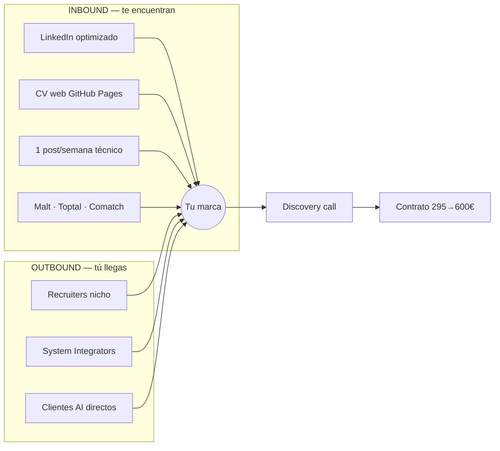

# 🎯 Atraer la demanda hacia tu talento (Top-of-the-top)

Objetivo: que recruiters, consultoras y clientes te **busquen a ti**. Dos motores en paralelo.



---

## 0. Tu pitch de 1 línea (memorízalo)
> *"Diseño plataformas Cloud y de IA con GPU para entornos regulados — co-dueño del hub Azure de Mercedes-Benz y arquitecto principal de su AI factory NVIDIA."*

---

## 1. INBOUND — que te encuentren

### a) LinkedIn (canal #1)
- Headline + About: usa `01_LinkedIn_Optimizado.md`.
- Modo **"recruiters only"** (sigues en Mercedes).
- **Creator mode ON**. Custom URL ✓.

### b) CV web vivo
- Activa GitHub Pages → `https://jorgeaguirre150-source.github.io/Freelance-Project-Jorge/`
- Pégalo en: LinkedIn Featured, firma de email, perfiles Malt/Toptal.

### c) Contenido = autoridad (1 post/semana, 20 min)
Tu nicho es escaso → cada post te posiciona. **4 ideas listas:**
1. *"Cómo diseñé un AI factory multi-tenant con GPU para un entorno regulado"* (Minerva, sin datos confidenciales).
2. *"vCluster-style isolation en AKS/EKS: 3 lecciones que aprendí a escala"*.
3. *"−30% de coste AWS con Terraform: el patrón de módulos reutilizables"*.
4. *"Agentic RAG con audit trail GxP: por qué la verificabilidad lo cambia todo"*.

**Plantilla de post (hook → valor → CTA):**
```
[HOOK provocador en 1 línea]
Ej: "La mayoría monta plataformas GPU que nadie puede auditar. En pharma eso no vale."

[3-5 bullets de valor real / lecciones]
• ...
• ...

[Cierre + CTA suave]
"Así lo resolvimos. ¿Tu equipo está montando infra GPU para IA? Hablemos."
#CloudArchitecture #GPU #AgenticAI #Kubernetes
```

---

## 2. OUTBOUND — mensajes finales (copiar-pegar)

> Regla de oro: **nunca digas la tarifa primero**. Si preguntan: *"Mi rango para este scope va entre X e Y; depende del alcance."*

### A) Conexión a recruiter nicho (LinkedIn, <300 car., EN)
```
Hi {NAME}, Senior Cloud & AI Platform Architect here (currently at Mercedes-Benz — NVIDIA AI factory, Terraform, AKS/EKS, GPU). Open to remote contract roles across EU/US. If you place Cloud/AI infra contractors, glad to connect.
```

### B) System Integrator / consultora (te subcontratan, EN)
```
Subject: Independent Cloud/AI architect for your client projects

Hi {NAME},

Independent Senior Cloud & AI Platform Architect partnering with consultancies that need senior delivery on:
• Cloud landing zones & hub-and-spoke (Azure/AWS), Terraform/Terragrunt, CI/CD
• Multi-tenant Kubernetes (AKS/EKS) and GPU/AI platform enablement (NVIDIA)
• Agentic AI / RAG for regulated clients (pharma, healthcare, automotive, finance)

Currently co-owning Mercedes-Benz's mAzure HUB. Remote EU/US.

If you have client demand here, worth a 15-min call?

Jorge Aguirre — aguirre_coslada@hotmail.com
```

### C) Cliente directo (startup/scale-up AI, EN)
```
Subject: Your GPU/AI infra — a senior second opinion

Hi {NAME},

Saw {COMPANY} is scaling {AI_PRODUCT}. Fast-growing AI infra usually hits the same walls: GPU utilization, multi-tenant isolation, cost.

I architect exactly this — principal architect of Mercedes-Benz's NVIDIA AI factory (per-tenant GPU on NGC/CUDA, AKS/EKS, secure runtime).

Free 30-min teardown of your setup + top 3 quick wins. No pitch. Worth a call?

Jorge Aguirre — aguirre_coslada@hotmail.com
```

### D) Malt / cliente español (ES)
```
Hola {NAME},

Arquitecto Cloud & IA senior. Co-responsable de la plataforma Azure multi-región de Mercedes-Benz y −30% de coste AWS vía Terraform. Aporto: IaC + CI/CD, Kubernetes multi-tenant (AKS/EKS) y habilitación de cargas GPU/IA, en entornos regulados.

Propongo una llamada corta para mapear vuestro stack y los quick-wins. ¿Cuál es vuestro objetivo nº1 de los próximos 30 días?

Jorge — aguirre_coslada@hotmail.com · +34 687 172 900
```

---

## 3. TARGETS concretos

### Recruiters de nicho Cloud/AI/Contract (EU/UK) — conecta con sus consultores
- **Tenth Revolution Group / Nigel Frank** (Azure/AWS nicho) 🔥
- **Computer Futures** (cloud/devops contract, EU)
- **Darwin Recruitment** (cloud/data, EU)
- **Understanding Recruitment** (AI/ML)
- **Harnham** (data/AI)
- **Burns Sheehan / La Fosse** (platform/devops UK)
- **Method Resourcing / Opus Recruitment**
> En LinkedIn busca: `("Cloud" OR "DevOps" OR "AI") recruiter (contract) (EU OR remote)` y conecta con la nota A.

### System Integrators / consultoras (subcontratación)
Grandes: **Accenture, Capgemini, Deloitte (Cloud/AI), Avanade (Azure), Slalom, Thoughtworks**.
Cloud-native: **Cloudreach, Contino, Mesh-AI, ClearScale, Lemongrass**.
España: **Plain Concepts, Paradigma Digital, Keepler, Bluetab, Datatonic**.
> Contacto: en LinkedIn busca en cada una "Talent Acquisition" o "Resource/Bench Manager" + "Cloud/AI" → nota B.

### Clientes directos
- AI scale-ups con GPU (Wellfound, YC list).
- Pharma/CRO digital (tu GxP + Agentic AI = rarísimo).
- Automotive/OEM Tier-1 (tu lenguaje nativo).

---

## 4. Cadencia semanal de atracción (30-40 min/día)
| Día | Inbound | Outbound |
|-----|---------|----------|
| L | — | 10 conexiones recruiter (A) |
| M | Comentar 2 posts NVIDIA/HashiCorp/Anthropic | 5 emails SI (B) |
| X | 1 post propio | 3 clientes directos (C) |
| J | Responder InMails | 5 Malt/ES (D) |
| V | Revisar dashboard + aplicar | Follow-ups |

---

## 5. KPIs de atracción
| Métrica | Target/mes |
|---------|-----------|
| Profile views LinkedIn | +50% |
| InMails/leads inbound | ≥ 8 |
| Conexiones recruiter nicho | 40 |
| Impresiones de posts | crece semana a semana |
| Discovery calls | ≥ 4 |

> El agente n8n te trae las ofertas; **esto te trae a los clientes**. Los dos motores juntos = pipeline lleno.
