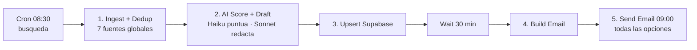

# Daily Freelance Hunter — Agente n8n

Busca cada mañana ofertas freelance Cloud/AI (EU + global), las puntúa con IA contra tu perfil, redacta borradores de propuesta y te manda un email con la shortlist. **No aplica solo** — tú revisas y envías.

## Flujo



> **Horario**: la búsqueda corre a las **08:30** (cron `30 8 * * *`); un nodo **Wait** de 30 min retrasa el envío para que el reporte llegue hacia las **09:00** al correo del CV (`aguirre_coslada@hotmail.com`). Para envío a una hora exacta, cambia el Wait a modo *"At Specified Time"*.

| Nodo | Qué hace |
|------|----------|
| Cron 08:30 | Dispara la búsqueda cada día a las 08:30 (cron `30 8 * * *`) |
| Wait → 09:00 | Espera 30 min para que el reporte se envíe hacia las 09:00 |
| 1. Ingest + Dedup | Fetch a 4 APIs legales, prefiltro por keywords, dedup entre días (`workflowStaticData`, caduca 30d) |
| 2. AI Score + Draft | 1 llamada **Haiku** puntúa 0-100; filtra ≥70, top 10; 1 llamada **Sonnet** redacta borradores |
| 3. Build Email | Genera el HTML con tarjetas (fuente, match, link, borrador) |
| 4. Send Email | Envía vía tu SMTP |

## Setup (≈20 min)

### 1. Importar
n8n → **Workflows** → **Import from File** → `daily_freelance_hunter.n8n.json`

### 2. Variables de entorno (n8n)
En el host de n8n (docker-compose `environment:` o `.env`):
```
ANTHROPIC_API_KEY=sk-ant-...
ADZUNA_APP_ID=tu_app_id        # gratis en developer.adzuna.com
ADZUNA_APP_KEY=tu_app_key
N8N_BLOCK_ENV_ACCESS_IN_NODE=false   # permite leer $env en Code nodes
```
> Adzuna es opcional pero recomendado (agrega miles de boards EU). Sin sus keys, el agente usa las otras 3 fuentes igual.

### 3. Credencial SMTP
Nodo **4. Send Email** → Credenciales → crea **SMTP**:
- Gmail: host `smtp.gmail.com`, port `465`, SSL on, user = tu Gmail, pass = **App Password** (no la normal).
- Outlook/Hotmail: host `smtp-mail.outlook.com`, port `587`, STARTTLS.
Ajusta `fromEmail` / `toEmail` en el nodo.

### 4. Verifica el model ID
En el nodo **2. AI Score + Draft**, confirma que `MODEL_SCORE` y `MODEL_DRAFT` son los IDs vigentes en tu cuenta Anthropic (p.ej. `claude-haiku-4-5`, `claude-sonnet-4-5`). Ajústalos si tu consola muestra otros.

### 5. Probar y activar
- **Execute Workflow** (run manual) → revisa que llega el email.
- Si OK → toggle **Active** (arriba a la derecha). Ya corre solo cada mañana.

## Ampliar fuentes (las plataformas sin API)
LinkedIn / Malt / Upwork no tienen API legal para scraping. Patrón recomendado:
1. Crea **alertas de búsqueda** en cada una → que lleguen a un **Gmail dedicado**.
2. Añade un nodo **Gmail Trigger / IMAP** al inicio que lea ese inbox y vuelque las ofertas al nodo de IA.
*(Te lo añado como Sprint 2 cuando quieras.)*

## Personalizar
- **Keywords / países Adzuna**: edita el array `KEYWORDS` y `ADZUNA_COUNTRIES` en el nodo 1.
- **Umbral de match**: cambia `>=70` en el nodo 2.
- **Tono/longitud del borrador**: edita `draftSys` en el nodo 2.
- **Hora**: cambia el cron del Schedule Trigger.

## ROI

| Variable | Valor |
|----------|-------|
| Tiempo búsqueda manual diaria | ~60-75 min |
| Tiempo con el agente (revisar email) | ~10 min |
| **Ahorro/día** | ~55 min |
| Ahorro/mes (22 días) | **~20 h/mes** |
| Valor a tu tarifa (295 €/día ≈ 37 €/h) | **~740 €/mes** equivalentes |
| Coste operación | Claude ~3-6 €/mes + n8n self-host ~0 |
| **Payback** | < 1 día de construcción |

> Beneficio real no es solo el tiempo: es **constancia** (nunca te saltas un día) y **velocidad de respuesta** (<24h sube el ratio de respuesta del cliente).

## Guardrails activos
- Human-in-the-loop: nunca envía aplicaciones solo.
- Solo APIs legales (sin scraping de LinkedIn/Malt).
- Dedup persistente: no repite ofertas.
- Prefiltro por keywords antes de gastar tokens (coste bajo).
- `safe()` por fuente: si una API cae, las demás siguen.
